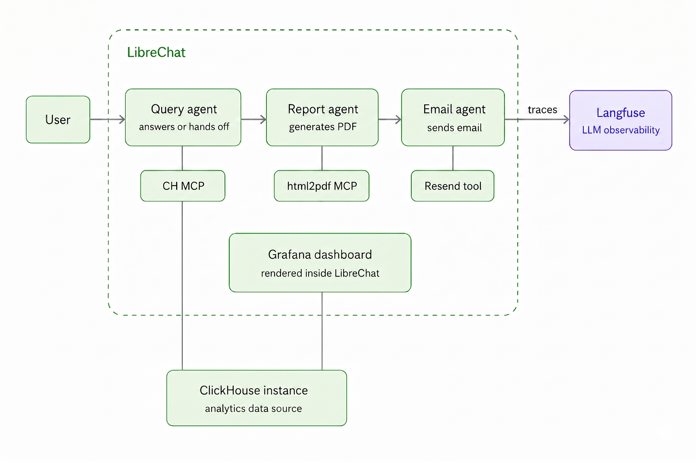

# Analytics Reporting Agent

A conversational analytics reporting system built on **ClickHouse** and **LibreChat**. Ask a question in plain English, get a live data answer, a styled PDF report, or have it delivered to your inbox — all from a single chat interface.



---

## What it does

| You say | What happens |
|---|---|
| *"Which UTM sources bring the most users?"* | Query Agent answers directly in chat |
| *"Generate a PDF report of UTM sources"* | Query Agent → Report Agent → download link |
| *"Email me a UTM source report"* | Query Agent → Report Agent → Email Agent → inbox |

---

## Stack

| Component | Role |
|---|---|
| [LibreChat](https://librechat.ai) | Chat interface and agent orchestration |
| [ClickHouse](https://clickhouse.com) | Analytics database |
| [ClickHouse MCP](https://github.com/ClickHouse/mcp-clickhouse) | Connects Query Agent to ClickHouse |
| [html2pdf MCP](https://github.com/your-repo/html2pdf) | Converts HTML template to PDF |
| [nginx](https://nginx.org) | Serves generated PDFs |
| [Resend](https://resend.com) | Email delivery |
| [Grafana](https://grafana.com) | Live dashboard embedded in LibreChat |
| [Langfuse](https://langfuse.com) | LLM observability and tracing |

---

## Prerequisites

- Docker and Docker Compose
- Python 3.8+ (for data generation)
- A [Resend](https://resend.com) account and API key
- A [Langfuse](https://langfuse.com) account (optional, for tracing)

---

## Setup

### 1. Clone the repo

```bash
git clone https://github.com/yourusername/analytics-reporting-agent
cd analytics-reporting-agent
```

### 2. Configure environment variables

Copy the example env file and fill in your values:

```bash
cp .env.example .env
```

```env
# ClickHouse
CLICKHOUSE_HOST=host.docker.internal
CLICKHOUSE_PORT=8123
CLICKHOUSE_USER=default
CLICKHOUSE_PASSWORD=your_password_here

# Resend
RESEND_API_KEY=your_resend_api_key_here
RESEND_FROM=onboarding@resend.dev
RESEND_TO=your@email.com

# Langfuse (optional)
LANGFUSE_PUBLIC_KEY=your_public_key
LANGFUSE_SECRET_KEY=your_secret_key
LANGFUSE_HOST=https://cloud.langfuse.com
```

### 3. Start the services

```bash
docker compose up -d
```

This starts:
- LibreChat at `http://localhost:3080`
- ClickHouse MCP at `http://localhost:8001`
- html2pdf MCP at `http://localhost:3100`
- PDF nginx server at `http://localhost:8888`

### 4. Generate synthetic data

```bash
cd data
pip install -r requirements.txt
python generate_data.py
```

This creates `10,000` synthetic events across devices, countries, UTM sources, and funnel stages in your ClickHouse instance.

### 5. Set up the agents in LibreChat

Go to `http://localhost:3080` → Agents → Create New Agent.

Create three agents in this order. Paste the system prompts from the `agents/` folder:

| Agent | Prompt file | Tool to attach |
|---|---|---|
| Query Agent | `agents/query_agent.md` | ClickHouse MCP |
| Report Agent | `agents/report_agent.md` | html2pdf MCP |
| Email Agent | `agents/email_agent.md` | Resend tool |

### 6. Configure agent handoffs

In **Query Agent** → Advanced Settings → Agent Handoffs → add **Report Agent**

In **Report Agent** → Advanced Settings → Agent Handoffs → add **Email Agent**

The Query Agent is your only entry point. Handoffs happen automatically.

---

## Data schema

Two tables power the system:

```sql
-- analytics.events
-- Stores every user interaction
CREATE TABLE analytics.events
(
    user_id      String,
    session_id   String,
    event_name   String,          -- view_homepage, view_product_page, view_cart,
                                  -- view_checkout, view_purchase, click,
                                  -- rage_click, form_error, scroll
    timestamp    DateTime64,
    page_url     String,
    device       LowCardinality(String),   -- desktop, mobile, tablet
    country      LowCardinality(String),   -- US, IN, GB, DE, CA, AU, FR
    utm_source   LowCardinality(String)    -- google, facebook, direct, email, twitter
)
ENGINE = MergeTree()
ORDER BY (utm_source, device, timestamp);

-- analytics.sessions
-- Session-level aggregates
CREATE TABLE analytics.sessions
(
    session_id    String,
    user_id       String,
    session_start DateTime64,
    session_end   DateTime64,
    event_count   UInt32,
    entry_page    String,
    exit_page     String,
    device        LowCardinality(String),
    country       LowCardinality(String),
    utm_source    LowCardinality(String)
)
ENGINE = MergeTree()
ORDER BY (session_start, device, country);
```

---

## Agent prompts

Each agent prompt is in the `agents/` folder. They are plain markdown files — paste the contents directly into the LibreChat agent system prompt field.

- `agents/query_agent.md` — queries ClickHouse, answers or hands off
- `agents/report_agent.md` — fills HTML template, generates PDF
- `agents/email_agent.md` — sends PDF link via Resend

The HTML report template used by the Report Agent is in `templates/report_template.txt`.

---

## Grafana dashboard

Grafana is not included in this docker-compose but can be connected to the same ClickHouse instance as a data source. To embed it inside LibreChat, add an iframe in your LibreChat configuration pointing to your Grafana dashboard URL.

---

## Observability with Langfuse

If Langfuse credentials are set in `.env`, LibreChat will automatically send traces for every agent interaction. No custom instrumentation needed.

Traces include:
- Which agent handled each step
- Prompt and response at each stage
- Token usage and cost per step
- End-to-end latency

---

## Troubleshooting

**html2pdf SSE connection dropping**

Add `--keep-alive 30` to the mcp-proxy command in `docker-compose.yml`:

```yaml
command: >
  sh -c "... mcp-proxy --port 3100 --host 0.0.0.0 --keep-alive 30 -- node dist/index.js"
```

**Agent not handing off**

Check that Agent Handoffs are configured under Advanced Settings for the correct agent. Re-save the settings if the handoff target disappears after saving.

**PDF is blank or missing charts**

This usually means the Report Agent rewrote the HTML template instead of filling it. Re-send the request — if it persists, check the Langfuse trace to see what HTML was passed to `convert_html_to_pdf`.

---

## Project structure

```
analytics-reporting-agent/
├── README.md
├── docker-compose.yml
├── librechat.yaml
├── .env.example
├── .gitignore
├── data/
│   ├── generate_data.py
│   └── requirements.txt
├── html2pdf/
│   └── dist/
├── agents/
│   ├── query_agent.md
│   ├── report_agent.md
│   └── email_agent.md
├── templates/
│   └── report_template.txt
└── architecture.png
```

---

## License

MIT
